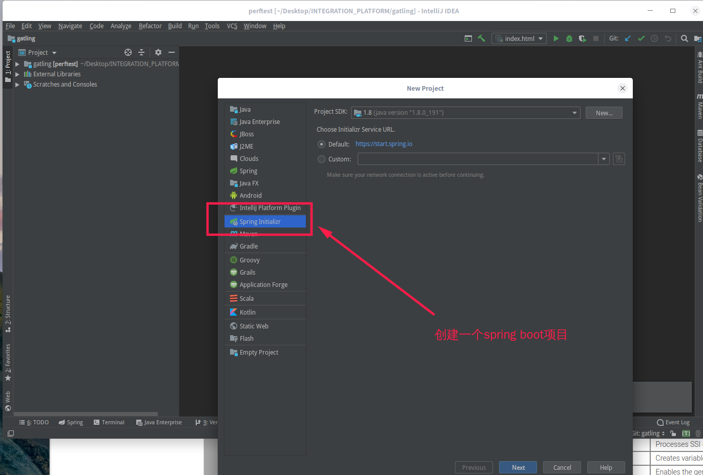
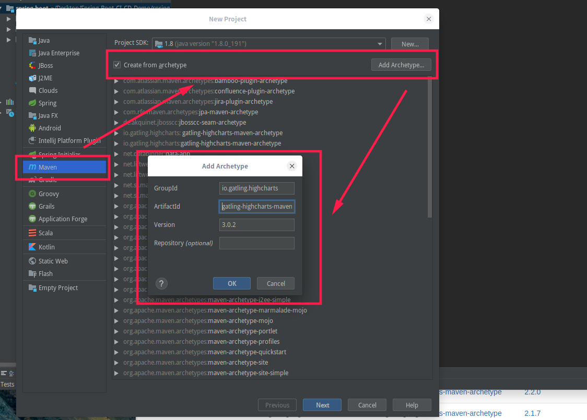

# spring boot使用gatling进行压力测试

1. 服务器端代码编写

   1. 先书写spring boot项目代码

      

   2. 接着创建gatling压力测试项目
      参考[链接](https://search.maven.org/search?q=g:io.gatling.highcharts%20AND%20a:gatling-highcharts-maven-archetype&core=gav)

      

      编写压力测试代码(src/test/scala目录中添加代码)

      ```scala
      import io.gatling.core.Predef._
      import io.gatling.core.structure.ScenarioBuilder
      import io.gatling.http.Predef._
      import io.gatling.http.protocol.HttpProtocolBuilder
      
      class SpringBootTest extends Simulation {
      
        val httpProtocol: HttpProtocolBuilder = http
          .baseUrl("http://localhost:8080")
      
        val scn: ScenarioBuilder = scenario("spring boot test")
          .repeat(10) {
            exec(http("request").get("/persons"))
          }
      
        setUp(
          scn.inject(atOnceUsers(1000))
        ).protocols(httpProtocol)
      }
      ```

      为了能够在一个项目中进行多项测试需要配置gatling的maven插件

      ```java
      <plugin>
      	<groupId>io.gatling</groupId>
      	<artifactId>gatling-maven-plugin</artifactId>
      	<version>${gatling-maven-plugin.version}</version>
      	<configuration>
      		<runMultipleSimulations>true</runMultipleSimulations>  <!-- 允许跑多个测试 -->
      		<includes>
      			<param>SpringBootTest</param>		<!-- 第一个测试的名称 -->
      			<param>ClassRoomsTest</param>		<!-- 第二个测试的名称 -->
      		</includes>
      	</configuration>
      </plugin>
      ```

      

2. 开始压力测试

   1. 先启动spring boot项目

      ```shell
      mvn clean package
      # 上一步命令打包spring boot项目，并且会进行单元测试，单元测试错误则无法进行打包工作
      java -jar target/springboot-0.0.1-SNAPSHOT.jar
      ```

   2. 再启动gatling压力测试项目

      ```shell
      # 只进行这一项测试
      mvn gatling:test -Dgatling.simulationClass=ClassRoomsTest
      
      # 进行所有的测试
      mvn gatling:test
      
      # 生成的测试结果在tagert/gatling目录下
      ```

3. Spring boot代码和压力测试代码混合在一起

   项目[链接](./code/gatling)

4. 使用[wg/wrk](https://github.com/wg/wrk)进行压力测试

   ```shell
   wrk -t8 -c128 -d1m http://127.0.0.1:8080/persons --latency
   ```


#### 参考资料

* [gatling官方文档](https://gatling.io/documentation/)
* [Gatling简单测试SpringBoot工程](https://sanshengshui.github.io/2018/10/07/Gatling%E7%AE%80%E5%8D%95%E6%B5%8B%E8%AF%95SpringBoot%E5%B7%A5%E7%A8%8B/)


#### 参考资料copy

* [gatling压力测试spring boot项目](./doc/spring%20boot项目和gatling压力测试项目/index.html)