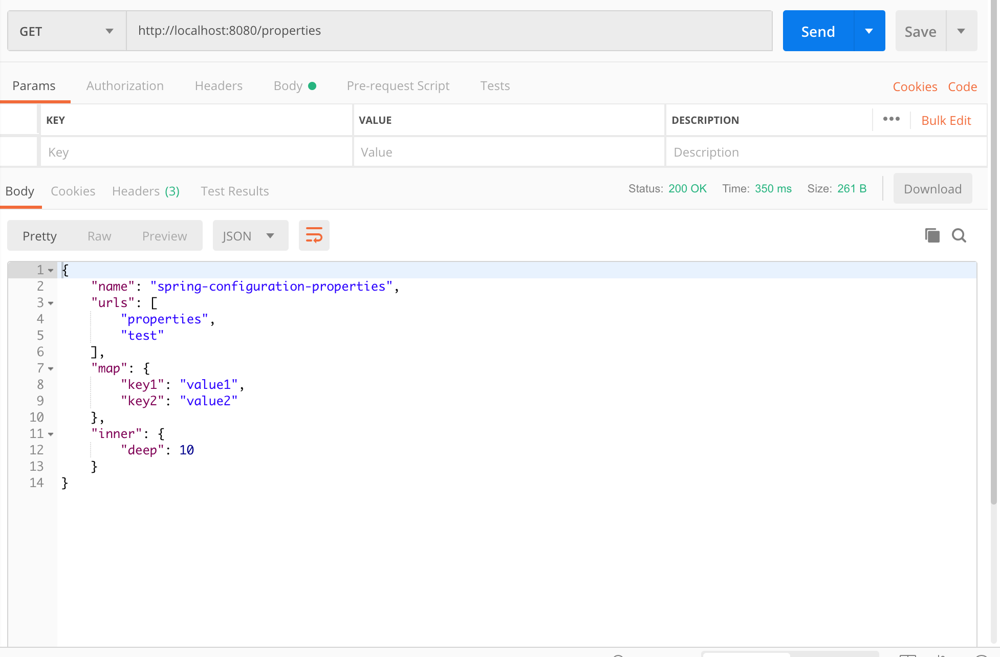

# spring-boot-configuration-properties的用法

1. 添加maven依赖

   ```java
   <dependency>
   	<groupId>org.springframework.boot</groupId>
       <artifactId>spring-boot-configuration-processor</artifactId>
       <optional>true</optional>
   </dependency>
   ```

2. 定义需要配置的类(使用`@ConfigurationProperties`注解标注前缀)

   ```java
   @ConfigurationProperties("web")
   @Data
   public class WebProperties {
       private String name;
       private String[] urls;
       private Map<String, String> map;
   
       private InnerClass inner;
   
       /* 类一定为static */
       @Data
       static class InnerClass {
           int deep;
       }
   }
   ```

3. 在spring boot启动类中使用`@EnableConfigurationProperties`注解使得spring boot扫描到配置类

   ```java
   @SpringBootApplication
   @EnableConfigurationProperties(WebProperties.class)
   public class SpringConfigurationPropertiesApplication {
   
       public static void main(String[] args) {
           SpringApplication.run(SpringConfigurationPropertiesApplication.class, args);
       }
   
   }
   ```

4. 点击build按钮使得编译器可以进行代码提示

5. 在`properties文件`中使用配置

   ```shell
   web.name=spring-configuration-properties
   web.urls=properties,test #数组用逗号分隔
   # 也可以使用这种方式
   # web.urls[0]=properties
   # web.urls[1]=test
   web.map.key1=value1
   web.map.key2=value2
   web.inner.deep=10
   ```

6. 在别的类中需要使用时直接使用`@Autowired`注入

   ```java
   @RestController
   @RequiredArgsConstructor
   public class WebController {
       private final WebProperties properties;
   
       @GetMapping("properties")
       public WebProperties properties() {
           return properties;
       }
   }
   ```

7. 访问示例

   


#### 参考资料

* [Guide to @ConfigurationProperties in Spring Boot](https://www.baeldung.com/configuration-properties-in-spring-boot)

* [spring-boot-configuration-properties-demo](https://github.com/callicoder/spring-boot-configuration-properties-demo)
